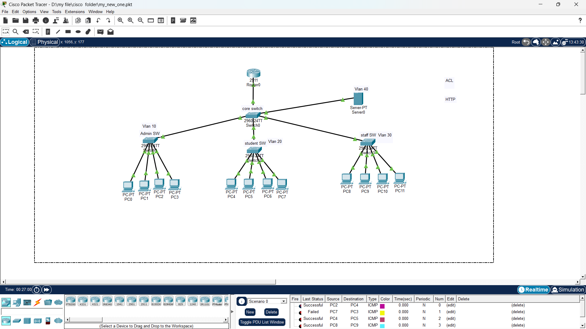

# 🔐 VLAN-Based Network Security Project

## 📌 Project Overview

This project demonstrates a **VLAN-based network with access control** designed and implemented using **Cisco Packet Tracer**.

The network is divided into separate VLANs for **Admin, Student, Staff, and Server** users. VLAN segmentation is used to separate different departments and improve network security.

Access control is implemented to control communication between different VLANs.

---

## 🌐 Network Diagram



---

## 🏢 VLAN Configuration

| VLAN ID | Name    | Purpose              |
| ------- | ------- | -------------------- |
| VLAN 10 | ADMIN   | Administrative users |
| VLAN 20 | STUDENT | Student users        |
| VLAN 30 | STAFF   | Staff users          |
| VLAN 40 | SERVER  | Server network       |

---

## 🖥️ Network Components

The network consists of:

* 1 Router
* 1 Core Switch
* 3 Access Switches
* 4 Admin PCs
* 4 Student PCs
* 4 Staff PCs
* 1 Server

---

## 🔐 Access Control Policy

### VLAN 10 — ADMIN

Admin users have the highest level of network access.

* Admin can communicate with Student devices.
* Admin can communicate with Staff devices.
* Admin can access the Server network.

### VLAN 20 — STUDENT

Student users have restricted network access.

* Student devices can communicate with other Student devices.
* Student users cannot communicate with Admin devices.
* Student users cannot communicate with Staff devices.

### VLAN 30 — STAFF

Staff users also have restricted network access.

* Staff devices can communicate with other Staff devices.
* Staff users cannot communicate with Admin devices.
* Staff users cannot communicate with Student devices.

### VLAN 40 — SERVER

The server is placed in a separate VLAN.

* Server network is isolated from the user VLANs.
* Access to the server is controlled through the network configuration.

---

## 🛡️ Security Implementation

The following security and networking concepts are implemented:

* VLAN Segmentation
* Inter-VLAN Routing
* Trunking
* Access Control List (ACL)
* Network Access Control
* Department-based Network Segmentation

---

## 🔧 Technologies Used

* **Cisco Packet Tracer**
* **Cisco IOS**
* **IPv4**
* **VLAN**
* **Inter-VLAN Routing**
* **ACL**

---

## 📋 VLAN Details

### 🔵 VLAN 10 — ADMIN

**Purpose:** Administrative network

**Devices:** PC0, PC1, PC2, PC3

**Access Level:** Full network access

---

### 🟢 VLAN 20 — STUDENT

**Purpose:** Student network

**Devices:** PC4, PC5, PC6, PC7

**Access Level:** Student VLAN communication only

---

### 🟠 VLAN 30 — STAFF

**Purpose:** Staff network

**Devices:** PC8, PC9, PC10, PC11

**Access Level:** Staff VLAN communication only

---

### 🟣 VLAN 40 — SERVER

**Purpose:** Server network

**Device:** Server0

---

## 🔗 Communication Policy

| Source  | Destination | Access       |
| ------- | ----------- | ------------ |
| ADMIN   | STUDENT     | ✅ Allowed    |
| ADMIN   | STAFF       | ✅ Allowed    |
| ADMIN   | SERVER      | ✅ Allowed    |
| STUDENT | STUDENT     | ✅ Allowed    |
| STAFF   | STAFF       | ✅ Allowed    |
| STUDENT | STAFF       | ❌ Restricted |
| STUDENT | ADMIN       | ❌ Restricted |
| STAFF   | ADMIN       | ❌ Restricted |
| STAFF   | STUDENT     | ❌ Restricted |

---

## 🔀 Network Architecture

The network follows a hierarchical structure:

**Router → Core Switch → Department Access Switches**

The Core Switch connects the Admin, Student, Staff, and Server networks.

Trunk links are used where required to carry VLAN traffic between network devices.

---

## 🧪 Network Testing

Connectivity can be tested using the `ping` command.

Example:

```text
PC> ping <destination-ip>
```

Testing is performed between devices in different VLANs to verify the configured access-control rules.

Successful communication confirms that the required access is available, while blocked communication confirms that the configured restrictions are working.

---

## 📁 Project Files

### Cisco Packet Tracer Project

`VLAN-Network-Security-Project.pkt`

### Network Topology

`topology.png`

The topology image is displayed above using a relative Markdown reference:

```markdown

```

---

## 🎯 Project Objectives

The main objectives of this project are:

1. To understand VLAN configuration.
2. To implement network segmentation.
3. To configure inter-VLAN communication.
4. To implement ACL-based access control.
5. To restrict unauthorized communication between departments.
6. To understand basic network security using Cisco devices.

---

## 🚀 Future Improvements

* Implement DHCP for automatic IP assignment.
* Add firewall-based security.
* Add additional ACL rules.
* Implement network monitoring and logging.
* Add redundancy using additional network devices.
* Implement additional server services.

---

## 👨‍💻 Author

**Pradeep P**

**B.E. Computer Science and Engineering — Cyber Security**

---

## ⭐ Project Status

**Completed — Cisco Packet Tracer VLAN Network Security Project**
